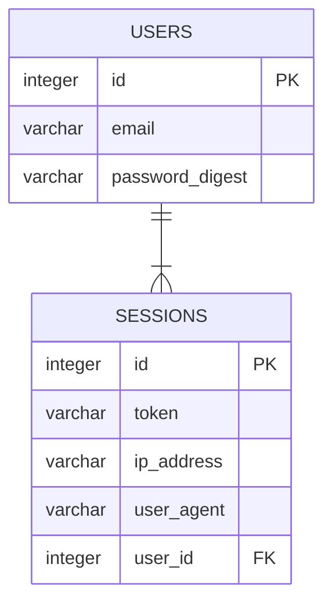

# Backend Evaluation 2025-06 - Park42

**Park42** is a car parking reservation service, similar to those used for booking airport parking spots in advance.

This monorepo contains the **Park42** API and a supporting mock payment service used during development.

## Requirements

- Ruby 3.4.4
- [Bundler](https://bundler.io/)
- [Docker](https://docs.docker.com/get-docker/) and [Docker Compose](https://docs.docker.com/compose/install/)

## Important Dependencies

- [Rails](https://github.com/rails/rails/)
- [Sidekiq](https://github.com/sidekiq/sidekiq)

## Setting Up

- `bin/bundle install` – Install all dependencies
- `docker-compose up --build` – Start PostgreSQL, Redis and the mock payment API
- `bin/rails db:setup` – Prepare the database

## Running

Use the wrapper scripts at the repository root to work with the Rails application.
During development the database and auxiliary services run inside Docker, while the application runs on the host.

- `docker-compose up` – Ensure the services are running
- `bin/dev` – Start the application with automatic reloading

## Description

The application is currently in its early stages and consists of a minimal set of entities and endpoints.

Users create `Sessions` to obtain a token and can request price calculations through the `/prices` endpoint.

## Entities

> [!WARNING]
> Standard Rails fields have been omitted from the diagram for brevity.

## Critics to the original code

In addition to a Pull Request for each task, it's expected from you to write a document criticizing the original code provided, where you can mention things that you would change or refactor if it was a real client project. Use the setup and code exploration phase to pay attention to informations that you would add to this document.

The document should be provided in a file called critics.md in a separate Pull Request.

## GitHub Instructions

**TODO**
