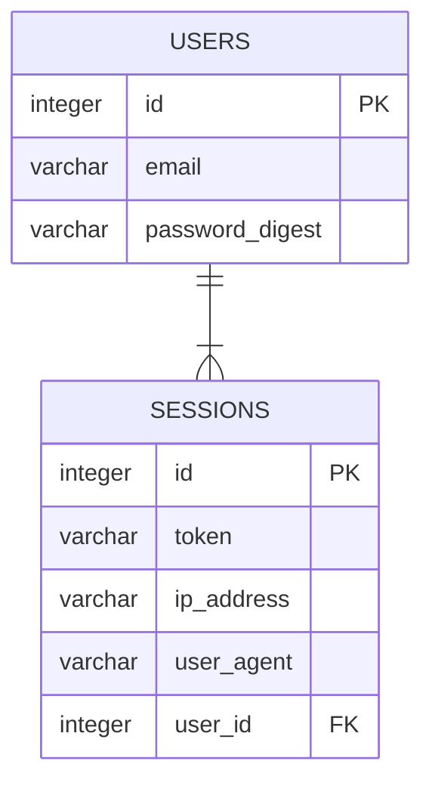

# Backend Evaluation 2025-06 - Park42 - Recognition

This monorepo contains the **Park42** Rails API and a supporting mock payment service used during development.

## Requirements

- Ruby 3.4.4
- [Bundler](https://bundler.io/)
- [Docker](https://docs.docker.com/get-docker/) and [Docker Compose](https://docs.docker.com/compose/install/)

## Important Dependencies

- [Rails](https://github.com/rails/rails/)
- [Sidekiq](https://github.com/sidekiq/sidekiq)
- [Solid Cache](https://github.com/basecamp/solid_cache)
- [Solid Queue](https://github.com/basecamp/solid_queue)
- [Solid Cable](https://github.com/basecamp/solid_cable)
- [Rswag](https://github.com/rswag/rswag) for API documentation

## Setting up

- `bin/bundle install` – Install all dependencies
- `docker-compose up --build` – Start PostgreSQL, Redis and the mock payment API
- `bin/rails db:setup` – Prepare the database

## Running

Use the wrapper scripts at the repository root to work with the Rails application.
During development the database and auxiliary services run inside Docker, while the application runs on the host.

- `docker-compose up` – Ensure the services are running
- `bin/dev` – Start the application with automatic reloading

## Description

Park42 is a small API with token-based authentication. Users create `Sessions` to obtain a token and can request price calculations through the `/prices` endpoint.

## Entities

> [!WARNING]
> Standard Rails fields have been omitted from the diagram for brevity.

## Critics to the original code

For each assignment you'll be asked to add a `critics.md` document with your thoughts on the provided code. Submit it together with your merge request.

